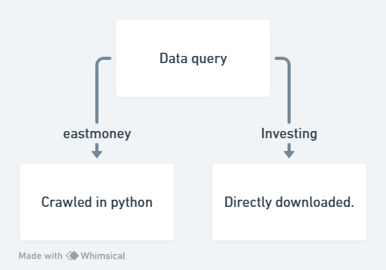

## Code

### Data query
#### eastmoney 
Crawled in python

#### Investing
Directly downloaded.

### Machine Learning
Using machine learning for sentiment analysis offers several benefits. Machine learning algorithms can quickly process and analyze large volumes of text data, making them highly efficient for sentiment analysis tasks. By training these algorithms on labeled data, they can learn to recognize and understand patterns, nuances, and context within language, allowing for more accurate sentiment classification. Additionally, machine learning models can adapt and improve over time, continuously refining their accuracy and performance as they encounter new data. This adaptability makes them well-suited for handling the evolving language and context of social media and other text-based platforms. Furthermore, machine learning models can identify complex and subtle sentiment patterns that may not be evident through traditional rule-based approaches, providing more nuanced and insightful sentiment analysis. This can be valuable for organizations seeking to understand and respond to public sentiment, improve customer experience, and make data-driven decisions.

### Reference
Whimsical. (2024). https://whimsical.com/
