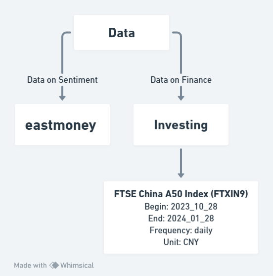

## Data
### Source
#### Data on Sentiment: eastmoney (social media)
Using social media as a database for sentiment analysis can be highly beneficial for organizations. Social media platforms contain vast amounts of user-generated content, including posts, comments, and reviews, which can be analyzed to gauge public sentiment towards a particular brand, product, or topic. This analysis can provide organizations with valuable insights into how their brand is perceived, as well as how customers feel about specific products or services. By understanding sentiment, organizations can identify areas for improvement, monitor public opinion in real-time, and make informed decisions to enhance their reputation and brand perception. Additionally, sentiment analysis on social media can be a valuable tool for identifying emerging trends, understanding public discourse, and assessing the effectiveness of marketing campaigns. This valuable feedback can be used to refine strategies, improve customer engagement, and ultimately, drive business growth.

#### Data on Finance: Investing
Investing is a comprehensive and widely-used financial database that provides a wide range of financial information and tools for investors and financial professionals. It offers detailed stock quotes, historical stock data, financial news, and analysis for a wide range of companies and industries. Additionally, Investing provides tools for portfolio tracking, stock screening, and interactive charting, making it a valuable resource for anyone looking to stay informed and make informed financial decisions.

### Variables
#### Ftse China A50 Index (FTXIN9)
Definition: a description of stock market in China

Frequency: daily

Range: 2023_10_28 - 2024_01_28

Unit: CNY

File type: csv

### Reference
eastmoney. (2024). Xin Gu Ba. [Social Media](https://guba.eastmoney.com/list,xg.html)

Investing. (2024). Ftse China A50. [Choice](https://cn.investing.com/indices/ftse-china-a50)

Whimsical. (2024). https://whimsical.com/
