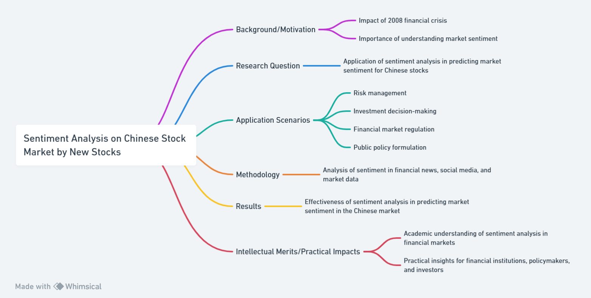

## Sentiment Analysis on Chinese Stock Market by New Stocks

Organization: Duke Kunshan University

Major: Applied Math

Course: Stats201

Date: 2024.1.28

### Background/Motivation

The financial crisis of 2008 had a profound impact on the global economy, and it highlighted the importance of understanding and predicting financial market sentiment. Sentiment analysis, as a field, has the potential to provide valuable insights into the sentiments and emotions of market participants and the public. Understanding and predicting market sentiment can contribute to improved risk management, investment decision-making, and financial stability.

Nowadays, many researches on the American Stock Market are conducted, while Chinese stocks are less concerned. Considering the unignorably large size of "A-Stocks" in China, research on it is needed. In this research sentiment analysis is applied to the forum about new stocks, and the A-stock market is studied.

### Research Question

This study aims to explore the application of sentiment analysis in predicting and understanding the market sentiment of Chinese stocks. The research question will focus on how sentiment analysis can be utilized to gauge public and market sentiment for new-released stocks, and how it can contribute to predicting market movements.

### Application Scenarios

The application of sentiment analysis in the context of Chinese stocks can be utilized in various scenarios, including risk management, investment decision-making, financial market regulation, and public policy formulation. Understanding market sentiment can provide valuable insights for policymakers, financial institutions, and investors, especially for those in the Chinese stock market.

### Methodology

The research will involve the analysis of sentiment in financial news, social media, and market data on new stocks in China. The study will utilize natural language processing and machine learning techniques to extract sentiment from textual data and analyze its impact on financial markets. Additionally, the research will verify the previous theory of sentiment analysis in predicting market movements in the Chinese market.

### Results

The study aims to provide insights into the effectiveness of sentiment analysis in predicting market sentiment in the Chinese market. The research will contribute to a better understanding of the potential applications of sentiment analysis in financial market risk management and investment decision-making.

### Intellectual Merits/Practical Impacts

The research findings can contribute to the academic understanding of sentiment analysis in the context of financial markets and provide practical insights for financial institutions, policymakers, and investors. The study has the potential to improve risk management practices and contribute to the development of investment strategies in the Chinese stock market.

### Reference

Rakshit, A. An explanatory Study of Sentiment Analysis and Sentiment Classification Approaches. https://www.ijetajournal.org/volume-8/issue-3/IJETA-V8I3P3.pdf

Azure OpenAI. (2024). Duke Kunshan University ChatGPT. Duke Kunshan University ChatGPT

Whimsical. (2024). https://whimsical.com/
